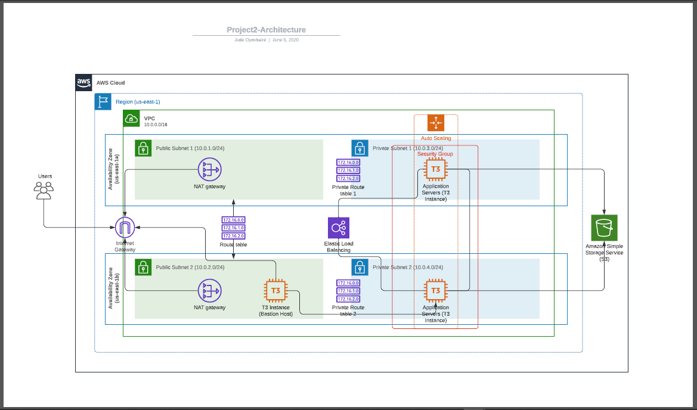

# Udacity-Cloud-DevOps-Engr-ND-Project-2

Project 2 of the Udacity Cloud DevOps Engineer Nanodegree:

Using Cloud Formation: deploy an application (Apache Web Server) and pick up code (JavaScript and HTML) from S3 Storage and deploy it in the appropriate folder on the web server.

## Architecture diagram



## How to run

```bash
# enter your credentials for AWS account
aws configure

# set up network infrastructure
./cf-script.sh udagram-network network.yml network-params.json

# wait for the network stack to complete before running, set up servers
./cf-script.sh udagram-server server.yml server-params.json


## Application URL

Application currently available [here](http://udagr-WebAp-1RDFRSK6R77T4-933787679.us-east-1.elb.amazonaws.com/)
